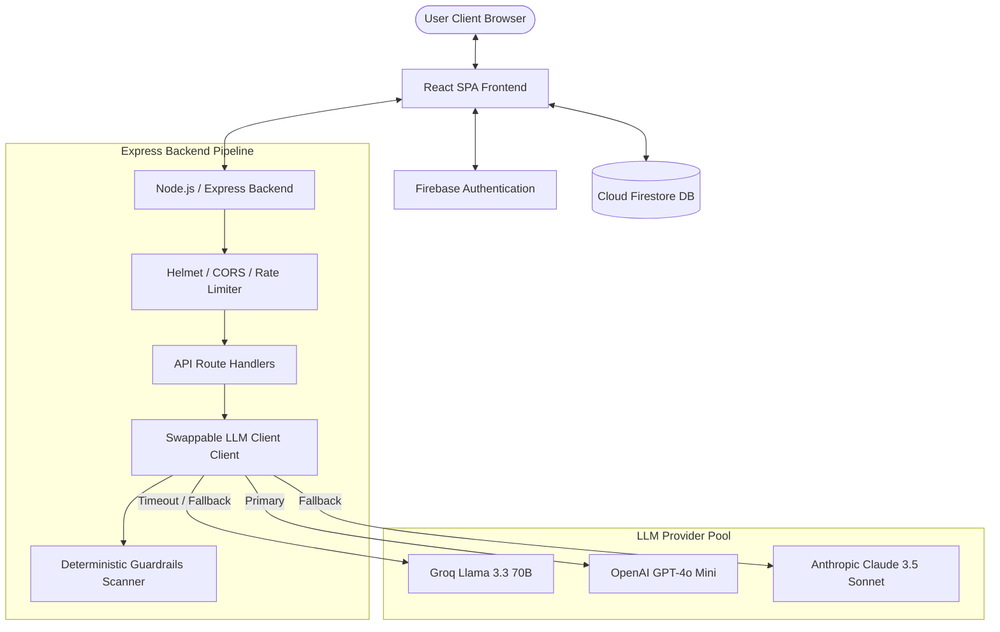
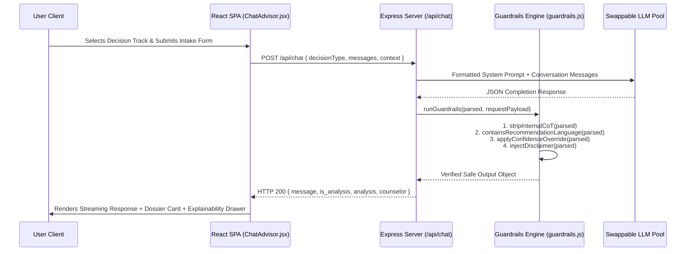

# LifeLens Master Documentation & Technical Source of Truth

**Project Name:** LifeLens — AI-Powered Life Decision Simulator & Framing Engine  
**Core Philosophy:** *"LifeLens helps users reason through decisions. LifeLens does not make decisions for users."*  
**Document Status:** Complete & Production Verified  
**Target Audience:** Maintenance Engineers, Product Architects, Security Auditors, and System Operators  

---

## 📑 Table of Contents
1. [Project Overview](#1-project-overview)
2. [Product Vision](#2-product-vision)
3. [Feature Inventory](#3-feature-inventory)
4. [Technical Architecture](#4-technical-architecture)
5. [Database Documentation](#5-database-documentation)
6. [API Documentation](#6-api-documentation)
7. [AI Systems Documentation](#7-ai-systems-documentation)
8. [Security Documentation](#8-security-documentation)
9. [Memory System Documentation](#9-memory-system-documentation)
10. [Testing Guide](#10-testing-guide)
11. [Deployment Guide](#11-deployment-guide)
12. [Maintenance Guide](#12-maintenance-guide)
13. [Technical Debt & Future Roadmap](#13-technical-debt--future-roadmap)

---

# 1. Project Overview

### What LifeLens Is
LifeLens is an AI-powered life decision simulator and structured diagnostic framing engine. It guides users through critical career, academic, and entrepreneurial choices by modeling multi-year outcomes, highlighting hidden trade-offs, surfacing implicit assumptions, and presenting objective Decision Dossiers.

### Core Philosophy
> **"LifeLens helps users reason through decisions. LifeLens does not make decisions for users."**

Every feature, AI prompt, frontend component, and backend guardrail is engineered to preserve 100% of the user's agency.

### Target Users
*   **Students & Applicants:** Evaluating graduate school options, competitive entrance exam eligibility bands (JEE, CUET, SAT, GRE), and institutional fit.
*   **Job Seekers & Professionals:** Evaluating job offers, salary expectations, skill gaps, and career trajectories.
*   **Early-Stage Founders & Entrepreneurs:** Structuring startup validation, testing business assumptions, calculating burn runway, and identifying data unknowns.

### Key Problems Solved
1.  **Decision Paralysis & Overwhelm:** Converts vague anxiety into structured decision matrices.
2.  **Unconsidered Trade-Offs:** Surfaces second-order consequences that users overlook.
3.  **Grade & Confidence Inflation:** Delivers direct, non-inflated assessments calibrated against empirical data and cutoffs.
4.  **Speculation & Hallucination:** Eliminates false certainty by enforcing factual attribution.

### What LifeLens Intentionally Does NOT Do
*   ❌ **NEVER Pick an Option:** LifeLens never generates prescriptive recommendation phrases like *"You should pick Option A"* or *"I recommend Option B"*.
*   ❌ **NEVER Predict Startup Success:** LifeLens never promises market success, guaranteed returns, or investor funding.
*   ❌ **NEVER Claim Certainty:** All multi-year projections are framed conditionally as possibilities.
*   ❌ **NEVER Leak Internal Reasoning:** Raw chain-of-thought scratchpads and system prompts are isolated and sanitized.
*   ❌ **NEVER Store Unrelated Personal Data:** Decision memory is strictly consent-based and limited to decision parameters.

---

# 2. Product Vision

### 1. Decision-Support Philosophy
LifeLens operates on structural framing rather than choice selection. It breaks complex options into 4 outcome vectors:
1.  **Short-Term Outcome (1–2 Year Horizon):** Immediate adaptation and operational realities.
2.  **Long-Term Outcome (5 Year Trajectory):** Multi-year career or institutional path.
3.  **Key Risk:** Structural downside or primary vulnerability.
4.  **Key Assumption:** Non-negotiable condition required for success.

### 2. No-Recommendation Guardrail Philosophy
Implemented via `backend/src/guardrails.js`. Every LLM output undergoes deterministic regex scanning against forbidden recommendation patterns (`/you should\b/i`, `/i recommend/i`, `/best choice/i`). Any violating response is rejected or re-routed.

### 3. Human-in-the-Loop (HITL) Philosophy
AI logic provides diagnostic data, but human expertise remains invaluable. LifeLens features a 3-domain **Human Guidance Directory** (`Admissions Advisors`, `Career Counselors`, `Startup Mentors`) providing regionalized, non-mandatory consultation links.

### 4. Explainability Philosophy
Implemented via `frontend/src/ExplainabilityDrawer.jsx`. Every factor, risk, and confidence rating includes factual attribution:
*   📌 **Influencing User Inputs**
*   🛠️ **Assumptions Used**
*   ❓ **Missing Information (Data Gaps)**
*   📊 **Confidence Rationale**
*   🔄 **Sensitivity Factors (What parameters change this output)**

### 5. Memory Philosophy
Implemented via `frontend/src/MemoryManagerModal.jsx`. Memory is strictly **consent-driven (ON/OFF)**, user-owned, editable, and clearable in one click. Only decision parameters (career roles, degrees, country preferences, budget, risk tolerance) are retained.

---

# 3. Feature Inventory

### 1. Graduate School Advisor
*   **Purpose:** Evaluates target degree programmes, competitive exam eligibility cutoffs, and university safety/reach tiers.
*   **Inputs:** Country, target degree, stream/branch, exam score/rank (JEE, CUET, SAT, GRE), budget.
*   **Outputs:** Structured college options, reach/target/safe classification, hidden trade-offs, branch questions.
*   **Components:** [`ContextIntake.jsx`](file:///Users/adityapathak/Downloads/second-brain%202/frontend/src/ContextIntake.jsx), [`ChatAdvisor.jsx`](file:///Users/adityapathak/Downloads/second-brain%202/frontend/src/ChatAdvisor.jsx), [`ConfidenceStamp.jsx`](file:///Users/adityapathak/Downloads/second-brain%202/frontend/src/ConfidenceStamp.jsx).
*   **APIs:** `POST /api/chat`, `POST /api/exams`.

### 2. Job Offer Evaluator
*   **Purpose:** Compares job offers, role responsibilities, skill gaps, and salary expectations.
*   **Inputs:** Role title, target companies, tech stack/skills, current situation, financial runway.
*   **Outputs:** Option comparison cards, immediate apply job matches, upskill job matches, salary estimates.
*   **Components:** [`ContextIntake.jsx`](file:///Users/adityapathak/Downloads/second-brain%202/frontend/src/ContextIntake.jsx), [`ChatAdvisor.jsx`](file:///Users/adityapathak/Downloads/second-brain%202/frontend/src/ChatAdvisor.jsx).
*   **APIs:** `POST /api/chat`.

### 3. ATS Resume Checker
*   **Purpose:** Evaluates PDF/DOCX candidate resumes against target roles without grade inflation.
*   **Inputs:** File upload (PDF/DOCX), target role title.
*   **Outputs:** Hard ATS Score (0–100), key strengths, critical gaps, portfolio recommendations.
*   **Components:** [`ResumeChecker.jsx`](file:///Users/adityapathak/Downloads/second-brain%202/frontend/src/ResumeChecker.jsx).
*   **APIs:** `POST /api/resume`.

### 4. Epistemological Startup Advisor
*   **Purpose:** Diagnostic matrix evaluating startup ideas without speculation or success predictions.
*   **Inputs:** Sector/field, team role, description, funding stage, savings runway, risk tolerance.
*   **Outputs:** 5-Part Diagnostic Matrix (Verified Observations, Explicit Assumptions, Critical Unknowns, Risk Pathways, Confidence Rationale) + Curated Investor Directory.
*   **Components:** [`StartupAssessmentView.jsx`](file:///Users/adityapathak/Downloads/second-brain%202/frontend/src/StartupAssessmentView.jsx), [`IdeaMeter.jsx`](file:///Users/adityapathak/Downloads/second-brain%202/frontend/src/IdeaMeter.jsx).
*   **APIs:** `POST /api/chat`, `POST /api/idea-meter`.

### 5. Decision Journey System
*   **Purpose:** Persistent decision tracking layer for saving, resuming, comparing, and archiving decision dossiers.
*   **Inputs:** Dossier snapshots, user notes, personal reflections, progress milestone checkboxes.
*   **Outputs:** Tabbed Journey Hub, side-by-side Dossier Comparator matrix, diff summaries (*"What Changed Since Previous Snapshot?"*).
*   **Components:** [`JourneyHub.jsx`](file:///Users/adityapathak/Downloads/second-brain%202/frontend/src/JourneyHub.jsx), [`DossierComparator.jsx`](file:///Users/adityapathak/Downloads/second-brain%202/frontend/src/DossierComparator.jsx), [`journeyService.js`](file:///Users/adityapathak/Downloads/second-brain%202/frontend/src/journeyService.js).
*   **APIs:** Firebase Firestore (`users/{userId}/journeys`).

### 6. Explainability Layer
*   **Purpose:** Interactive factor attribution explaining *why* factors were highlighted without CoT leakage.
*   **Inputs:** Option & analysis explainability metadata payload.
*   **Outputs:** Categorized attribution drawer (Inputs, Assumptions, Gaps, Confidence Rationale, Sensitivity Factors).
*   **Components:** [`ExplainabilityDrawer.jsx`](file:///Users/adityapathak/Downloads/second-brain%202/frontend/src/ExplainabilityDrawer.jsx).
*   **APIs:** Internal component prop rendering.

### 7. Human Guidance System (Expanded HITL)
*   **Purpose:** Regional directory matching users with human advisors across 3 decision domains.
*   **Inputs:** Domain (`grad_school`, `job`, `startup`), country, city/college search query.
*   **Outputs:** Domain-matched advisor cards, phone numbers, website links, safety disclaimers.
*   **Components:** [`HumanGuidanceModal.jsx`](file:///Users/adityapathak/Downloads/second-brain%202/frontend/src/HumanGuidanceModal.jsx), [`counselors.js`](file:///Users/adityapathak/Downloads/second-brain%202/backend/src/counselors.js).
*   **APIs:** `GET /api/human-guidance`, `GET /api/counselors`.

### 8. Consent-Based Memory System
*   **Purpose:** Consent-driven profile remembering decision-relevant parameters to pre-fill intake forms.
*   **Inputs:** Career interests, degree interests, country preferences, budget caps, risk tolerance score.
*   **Outputs:** Pre-filled intake defaults, transparency view, clear memory controls.
*   **Components:** [`MemoryManagerModal.jsx`](file:///Users/adityapathak/Downloads/second-brain%202/frontend/src/MemoryManagerModal.jsx), [`AuthContext.jsx`](file:///Users/adityapathak/Downloads/second-brain%202/frontend/src/AuthContext.jsx).
*   **APIs:** Firebase Firestore (`users/{userId}/memory/profile`).

---

# 4. Technical Architecture

### Architecture Overview
LifeLens employs a modern Single-Page Application (SPA) frontend decoupled from a stateless Express backend, backed by Firebase Auth, Cloud Firestore, and a swappable LLM provider adapter.



### Data Flow Diagrams

#### 1. Multi-Turn Advisor Chat Flow


---

# 5. Database Documentation

### Target Provider: Cloud Firestore (Firebase)

### Collection Hierarchy & Schema

#### 1. User Journeys Collection
**Path:** `users/{userId}/journeys/{journeyId}`

```typescript
interface JourneyDocument {
  id: string;                   // Auto-generated Firestore ID
  userId: string;               // Firebase Auth UID
  title: string;                // E.g. "Grad School Selection (Fall 2027)"
  decisionType: "grad_school" | "job" | "startup";
  status: "active" | "archived" | "completed";
  createdAt: number;            // Epoch timestamp
  updatedAt: number;            // Epoch timestamp
  context: Record<string, any>; // Intake parameters
  history: Array<{
    role: "user" | "assistant";
    content: string;
    timestamp?: number;
  }>;
  progress: Record<string, boolean>; // Milestone checklist completion
  dossiers: Array<{
    dossierId: string;
    savedAt: number;
    userNote?: string;
    reflection?: string;        // Personal user reflection notes
    analysis: Record<string, any>;
  }>;
}
```

#### 2. User Memory Profile Collection
**Path:** `users/{userId}/memory/profile`

```typescript
interface MemoryProfile {
  enabled: boolean;                 // Consent toggle (true/false)
  careerInterests: string[];        // E.g. ["Software Engineering", "Product"]
  degreeInterests: string[];        // E.g. ["MS CS", "MBA"]
  countryPreferences: string[];     // E.g. ["United States", "India"]
  budgetConstraints: string;       // E.g. "Self-funded up to $40k/yr"
  riskTolerance: number;            // 1 (Conservative) to 5 (Aggressive)
  updatedAt: number;                // Epoch timestamp
}
```

### Cloud Firestore Security Rules
Deploy the following rules to enforce tenant isolation:

```javascript
rules_version = '2';
service cloud.firestore {
  match /databases/{database}/documents {
    
    // User Journey Isolation
    match /users/{userId}/journeys/{journeyId} {
      allow read, write, update, delete: if request.auth != null && request.auth.uid == userId;
    }

    // User Memory Profile Isolation
    match /users/{userId}/memory/{docId} {
      allow read, write, update, delete: if request.auth != null && request.auth.uid == userId;
    }

    // Default Deny
    match /{document=**} {
      allow read, write: if false;
    }
  }
}
```

---

# 6. API Documentation

### 1. `POST /api/chat`
*   **Description:** Primary multi-turn advisor stream endpoint.
*   **Request Format:**
    ```json
    {
      "decisionType": "grad_school",
      "messages": [{"role": "user", "content": "I am deciding between IIT Bombay and San Jose State."}],
      "context": {"country": "United States", "targetDegree": "MS CS"}
    }
    ```
*   **Response Format:**
    ```json
    {
      "message": "Here is my final assessment...",
      "is_analysis": true,
      "analysis": { "summary": "...", "options": [...] },
      "counselor": { "name": "...", "phone": "..." }
    }
    ```

### 2. `POST /api/reason`
*   **Description:** Single-shot reasoning chain assessment endpoint.
*   **Request Format:**
    ```json
    {
      "decisionType": "job",
      "paths": [{"label": "Google — Software Engineer", "user_note": "Offers relocation"}],
      "constraints": {"risk_tolerance": 3, "financial_runway_months": 6}
    }
    ```

### 3. `POST /api/resume`
*   **Description:** Strict ATS resume evaluator endpoint. Supports PDF/DOCX file uploads.
*   **Request Format:** `multipart/form-data` with fields `resume` (file) and `targetRole` (string).

### 4. `POST /api/idea-meter`
*   **Description:** Fast startup idea scoring diagnostic.
*   **Request Format:** `{"description": "AI co-pilot for urban vertical farming"}`.

### 5. `GET /api/human-guidance`
*   **Description:** Regional Human Guidance Directory lookup.
*   **Query Parameters:** `domain` (`grad_school`|`job`|`startup`), `country`, `query`.

### 6. `GET /api/health`
*   **Description:** Health check. Returns `{"ok": true, "ts": 1784329200000}`.

---

# 7. AI Systems Documentation

### LLM Provider Pool & Fallback Architecture (`llmClient.js`)
LifeLens implements a swappable, resilient multi-provider LLM client:

```javascript
// Provider Resolution Chain
const providersToTry = [preferredProvider];
if (preferredProvider !== "groq" && process.env.GROQ_API_KEY) providersToTry.push("groq");
if (preferredProvider !== "openai" && process.env.OPENAI_API_KEY) providersToTry.push("openai");
if (preferredProvider !== "anthropic" && process.env.ANTHROPIC_API_KEY) providersToTry.push("anthropic");
```

### Timeout & Retry Controls
*   **Timeout Limit:** Every provider attempt is wrapped in `withTimeout(promise, 12000, label)`. If a request exceeds **12,000ms**, it times out and triggers fallback recovery.
*   **Attempt Limit:** Up to 2 attempts per provider before moving to the next provider in the pool.
*   **Groq Tiered Fallback:** Tries `llama-3.3-70b-versatile` first; on rate limit (429), falls back instantly to `llama-3.1-8b-instant`.

---

# 8. Security Documentation

### Security Safeguards Implemented
1.  **Helmet Secure Headers (`server.js`):** Enforces CSP, HSTS, X-Frame-Options, and X-Content-Type-Options.
2.  **Strict CORS Origin Whitelisting:** Restricts requests strictly to trusted frontend domains (`ALLOWED_ORIGINS`).
3.  **Dual-Layer Rate Limiting:**
    *   *Global IP Limiter:* 200 requests per 15 minutes.
    *   *LLM API Limiter:* 15 requests per minute.
    *   *Usage Abuse Monitor (`usageMonitor.js`):* Automatically blocks abusive IPs.
4.  **Payload Length Cap:** Restricts request body parsing to `100kb`.
5.  **CoT Purging (`stripInternalCoT`):** Recursively deletes any internal scratchpads or chain-of-thought keys (`chain_of_thought`, `cot`, `internal_reasoning`, `thinking`, `scratchpad`).

---

# 9. Memory System Documentation

### User Memory Controls & Consent Workflow
```
[User Logged In] 
       │
       ├── Consent Toggle: ON/OFF ────► When OFF: No parameters saved or auto-filled.
       │
       ├── View & Edit Parameters ────► Career, Degree, Country, Budget, Risk Tolerance.
       │
       └── One-Click Deletion ────────► "Clear Memory 🗑️" purges Firestore profile.
```

---

# 10. Testing Guide

### Verification Commands & Test Procedures
1.  **Frontend Production Build Verification:**
    ```bash
    cd frontend && npm run build
    ```
    *Expected Outcome:* Transforms modules and outputs `dist/` with **0 errors**.

2.  **Backend Health Check:**
    ```bash
    curl http://localhost:4000/api/health
    ```
    *Expected Outcome:* Returns `{"ok": true, "ts": ...}`.

3.  **Guardrail Compliance Verification:**
    Verify that completions containing `"you should"` trigger retry logic or fallback output.

---

# 11. Deployment Guide

### Environment Variables (.env)
```env
PORT=4000
LLM_PROVIDER=openai
OPENAI_API_KEY=sk-...
OPENAI_MODEL=gpt-4o-mini
GROQ_API_KEY=gsk_...
ANTHROPIC_API_KEY=sk-ant-...
ALLOWED_ORIGINS=http://localhost:5173,http://localhost:3000
METRICS_SECRET=your_secret_here
```

---

# 12. Maintenance Guide

### Architectural Principles for Future Developers
1.  **NEVER Bypass Guardrails:** Always route LLM output through `runGuardrails` in `backend/src/guardrails.js`.
2.  **NEVER Predict Success:** Keep prompts grounded in factual observations, hypotheses, and unknowns.
3.  **Preserve Tenant Isolation:** All Firestore operations must be scoped under `users/{userId}` using `request.auth.uid`.

---

# 13. Technical Debt & Future Roadmap

### Technical Debt Inventory
*   **Dual Mounting in `server.js`:** Dual `/api` and `/` route mounting is retained for Vercel routing compatibility.
*   **CSS Size:** `styles.css` covers all components (~3,700 lines); structured dividers maintain readability.

### Near-Term Roadmap
1.  **Offline Dossier Export (Q3 2026):** Client-side PDF/Markdown export for saved dossiers.
2.  **Interactive Sensitivity Sliders (Q3 2026):** Real-time parameter tweaking inside `ExplainabilityDrawer`.
