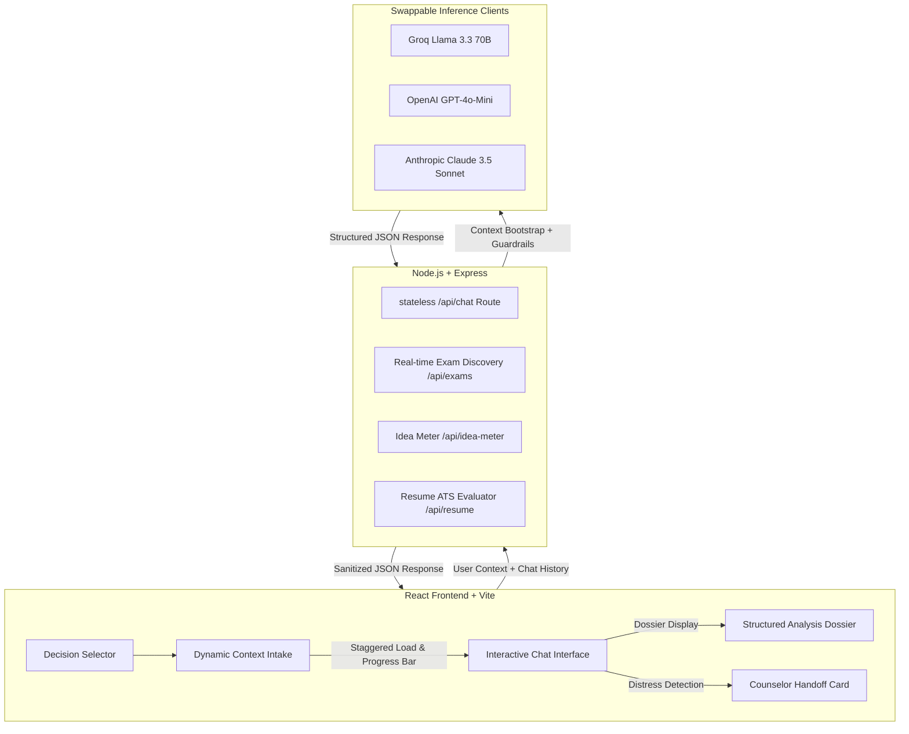

# LifeLens — Conversational Life Decision Advisor

> **Structuring complex choices so that the human decision remains fully informed.**

**LifeLens** (formerly *Second Brain*) is a conversational decision-reasoning advisor built for students and early professionals weighing major life paths. Instead of immediately dumping simplistic pros and cons, LifeLens guides users through an interactive, multi-turn exploration of critical details (prestige, financial runway, lifestyle preferences, post-grad visa regulations) before synthesising a structured **Dossier/Analysis** inline and connecting them with professional counselors.

It offers dedicated paths for three major decision categories:
*   🎓 **Graduate School** (University shortlists, degree goals, financial runway)
*   💼 **Job Offer** (Role evaluations, compensation packaging, skills matching)
*   🚀 **Startup** (Idea viability checks, sector analysis, risk tolerance)

---

## 🏗️ System Architecture



---

## ✨ Key Features

### 1. Merged Premium UI/UX
*   **Staggered Entrance Animations:** Inputs slide up with staggered fade-in sequences on mount for a fluid user experience.
*   **Dynamic Progress Tracking:** Sequential progress bars show filled/total inputs specific to the active decision path in real-time.
*   **Auto-Growing Textareas:** Text areas (Colleges, Companies, Description, and Skills) grow dynamically to fit text, eliminating scrollbars.
*   **Theme-Aware Custom Selects:** Dropdowns are backed by custom React select elements with smooth spring popovers and click-outside close handlers.

### 2. Intelligent Data Validations
*   **Real-time Exam Discovery:** Dynamic lookup based on selected country and target degree (e.g., matching JEE/BITSAT for B.Tech in India, SAT/GRE in the USA).
*   **Score Bounds Validation:** Sanitizes scores/ranks and displays instant feedback if scores are out of bounds.
*   **Preserved Master Exam Database:** Degree selection recommends specific exams (flagging them as "Best Match") without hiding others.

### 3. Human-in-the-Loop & Safety Guardrails
*   **No-Recommendation Guardrail:** The AI is strictly barred from telling you what to choose; it makes the tradeoffs visible using conditional framing.
*   **Distress Handoff:** Instantly connects the user to professional, localized academic or career counselors (UCAS in the UK, College Board in the US, iCall in India).
*   **Confidence Stamp:** Downgrades the analysis rating (`low`/`medium`/`high`) if crucial details are left empty.

---

## 📂 Project Structure

```bash
├── backend/
│   ├── src/
│   │   ├── chatPrompts.js      # System instructions for each decision path
│   │   ├── chatRoute.js        # Stateless Express chat endpoint
│   │   ├── counselors.js       # Country-to-counselor lookup directory
│   │   ├── examDatabase.js     # Master competitive exam dataset
│   │   ├── examDiscoveryRoute.js # Real-time exam lookup & recommendation logic
│   │   ├── llmClient.js        # Swappable LLM clients (Groq/OpenAI/Anthropic)
│   │   └── server.js           # Server initializer (Runs on port 4000)
├── frontend/
│   ├── src/
│   │   ├── App.jsx             # Main React entry point
│   │   ├── ChatAdvisor.jsx     # Multi-turn chat & dossier interface
│   │   ├── ContextIntake.jsx   # Staggered intake forms & progress bars
│   │   ├── CountrySelect.jsx   # Custom country autocomplete dropdown
│   │   ├── DegreeSelect.jsx    # Custom degree selector component
│   │   ├── ResumeChecker.jsx   # AI Resume ATS evaluation card
│   │   ├── IdeaMeter.jsx       # Interactive AI Startup idea validator
│   │   └── styles.css          # Premium design system & CSS rules
└── docs/                       # Technical specs & handoff documentation
```

---

## 🚀 Running the Application Locally

### 1. Run the Backend Server
1. Navigate to the `backend/` directory:
   ```bash
   cd backend
   ```
2. Install dependencies:
   ```bash
   npm install
   ```
3. Set up environment variables:
   ```bash
   cp .env.example .env
   ```
   *Open `.env` and fill in your API key (`GROQ_API_KEY` is highly recommended and pre-configured for free-tier Llama 3.3 inference).*
4. Start the server:
   ```bash
   npm start
   ```
   *The backend will run on `http://localhost:4000`.*

### 2. Run the Frontend Development Server
1. Navigate to the `frontend/` directory:
   ```bash
   cd ../frontend
   ```
2. Install dependencies:
   ```bash
   npm install
   ```
3. Launch the development server:
   ```bash
   npm run dev
   ```
   *The client will start on `http://localhost:5173` and proxy request endpoints to the Node backend.*
