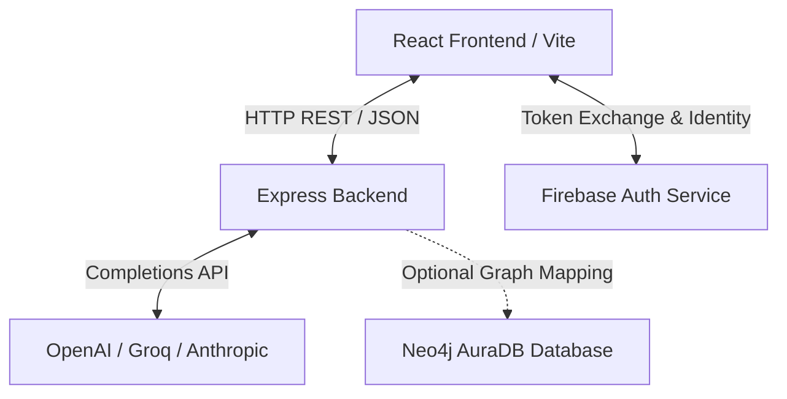

# System Architecture: LifeLens

This document outlines the software architecture, data flows, components, and technical design patterns for **LifeLens**, a conversational decision-reasoning engine designed to assist users in making structured life decisions (Graduate School, Job Offer evaluation, and Startup viability).

---

## 1. High-Level System Overview
LifeLens utilizes a decoupled client-server architecture. The frontend is a single-page application built on React, while the backend is a stateless REST API built on Node.js and Express.



---

## 2. Frontend Structure
The frontend is responsible for the user interface, routing, auth session state, intake parameter validation, and rendering interactive decision dossiers.

### Directory Layout
*   [`frontend/src/main.jsx`](file:///Users/adityapathak/Downloads/second-brain%202/frontend/src/main.jsx): Entry point initializing the React application.
*   [`frontend/src/App.jsx`](file:///Users/adityapathak/Downloads/second-brain%202/frontend/src/App.jsx): Root container coordinating navigation, theme toggles, and authentication gates.
*   [`frontend/src/AuthContext.jsx`](file:///Users/adityapathak/Downloads/second-brain%202/frontend/src/AuthContext.jsx): React Context provider managing user sign-in state, JWT retrieval, and interaction with Firebase Auth.
*   [`frontend/src/AuthPage.jsx`](file:///Users/adityapathak/Downloads/second-brain%202/frontend/src/AuthPage.jsx): Dedicated UI handling user Sign-In, Sign-Up (Email/Password), and Google Auth popup triggers.
*   [`frontend/src/ContextIntake.jsx`](file:///Users/adityapathak/Downloads/second-brain%202/frontend/src/ContextIntake.jsx): Form processing inputs like exam scores, budget runway, and location options.
*   [`frontend/src/ChatAdvisor.jsx`](file:///Users/adityapathak/Downloads/second-brain%202/frontend/src/ChatAdvisor.jsx): The conversational interface for multi-turn structured AI consultation.
*   [`frontend/src/ResumeChecker.jsx`](file:///Users/adityapathak/Downloads/second-brain%202/frontend/src/ResumeChecker.jsx): File drop zone and results parser for CV upload and ATS analysis.
*   [`frontend/src/IdeaMeter.jsx`](file:///Users/adityapathak/Downloads/second-brain%202/frontend/src/IdeaMeter.jsx): Interrogate startup viability, scores criteria, and provides investor matchups.
*   [`frontend/src/api.js`](file:///Users/adityapathak/Downloads/second-brain%202/frontend/src/api.js): Outbound client HTTP fetch calls directed to backend API endpoints.

---

## 3. Backend Structure
The backend acts as the secure execution layer. It validates client payloads, sanitizes parameters, enforces traffic rate limits, manages fallback logic, and structures prompts dispatched to downstream LLM APIs.

### Directory Layout
*   [`backend/src/server.js`](file:///Users/adityapathak/Downloads/second-brain%202/backend/src/server.js): Entry server config managing secure headers (Helmet), CORS, JSON payload size bounds, rate limiting, and global exceptions.
*   [`backend/src/llmClient.js`](file:///Users/adityapathak/Downloads/second-brain%202/backend/src/llmClient.js): Resilient client layer handling automatic model switches, timeouts, and fallbacks (OpenAI, Groq, Anthropic).
*   [`backend/src/usageMonitor.js`](file:///Users/adityapathak/Downloads/second-brain%202/backend/src/usageMonitor.js): In-memory metrics analyzer tracking requests, guardrail failures, and model drift statistics.
*   [`backend/src/reasonRoute.js`](file:///Users/adityapathak/Downloads/second-brain%202/backend/src/reasonRoute.js): Computes structured dossiers based on user constraints and paths.
*   [`backend/src/chatRoute.js`](file:///Users/adityapathak/Downloads/second-brain%202/backend/src/chatRoute.js): Guides multi-turn conversational intake.
*   [`backend/src/resumeRoute.js`](file:///Users/adityapathak/Downloads/second-brain%202/backend/src/resumeRoute.js): Parses uploaded documents and grades CV metrics against strict ATS parameters.
*   [`backend/src/ideaMeterRoute.js`](file:///Users/adityapathak/Downloads/second-brain%202/backend/src/ideaMeterRoute.js): Scores startup defensibility, TAM, and returns matching VC investors.
*   [`backend/src/examDiscoveryRoute.js`](file:///Users/adityapathak/Downloads/second-brain%202/backend/src/examDiscoveryRoute.js): Identifies eligibility requirements, pathways, and visas based on target countries.

---

## 4. Key Flows & Mechanics

### A. Authentication & Identity Flow
LifeLens integrates Firebase Authentication on the client side.
1.  **Identity Provider Interaction:** The client authenticates via Google Sign-In or Email Credentials.
2.  **Session Hook:** `AuthContext` monitors state via `onAuthStateChanged`.
3.  **State Propagator:** Once signed in, the application exposes the user profile to components and gates the central intake screens.

### B. Input Validation & Defense Flow
1.  **Length & Format Checks:** incoming request parameters are evaluated (e.g. paths size check, string parameter slicing, control characters stripped).
2.  **Size Restriction:** Global payload parsing limits bodies to 100KB (except resume upload).
3.  **Rate Limiter:** IPs are restricted dynamically on LLM routes (max 15/minute) and globally (max 200/15 minutes).

### C. File Upload Pipeline
```
[User drops resume file]
       ↓
[React sends multipart/form-data to /api/resume/parse]
       ↓
[Multer validates extension, reads buffer directly into memory]
       ↓
[Extractors parse text content via mammoth or pdf-parse]
       ↓
[Raw text sent to LLM with structured parsing instructions]
       ↓
[JSON results returned to client, bypassing disk storage]
```

### D. Data & Model Fallback Flow
If an LLM completions call fails, times out (12 seconds), or gets rate limited (HTTP 429):
1.  The client iterates through secondary API keys (OpenAI → Groq → Anthropic).
2.  If all LLM calls fail, a deterministic, static fallback generator parses local JSON matrices (e.g. `examDatabase.js`, `counselors.js`, `investors.js`) to provide the user with high-fidelity, safe placeholders.

---

## 5. Database Schema (Conceptual Graph Relationships)
When utilizing Neo4j AuraDB, entities and interactions are represented as nodes and relationships:

```
(u:User {uid: "FirebaseUID", email: "user@email.com"})
       │
       ├─[:HAD_SESSION]─→ (s:ChatSession {timestamp: 172111222, type: "job"})
       │
       └─[:EVALUATING]──→ (o:Option {name: "Option Name", type: "college"})
                            │
                            ├─[:REQUIRES_EXAM]─→ (e:Exam {id: "sat", max: 1600})
                            │
                            └─[:IN_LOCATION]───→ (l:Location {name: "United States"})
                                                   │
                                                   └─[:HAS_COUNSELOR]─→ (c:Counselor {phone: "..."})
```

---

## 6. API Interface Reference

| Method | Endpoint | Description | Expected Payload | Response |
| :--- | :--- | :--- | :--- | :--- |
| **POST** | `/api/reason` | Evaluates options and returns tradeoffs | `{ paths: [...], constraints: {...} }` | `JSON (dossier structure)` |
| **POST** | `/api/chat` | Chat message handler | `{ decision_type, history, context }` | `JSON (chat response + flags)` |
| **POST** | `/api/idea-meter` | Evaluates startup details | `{ idea, field, answers }` | `JSON (scores + matching VCs)` |
| **POST** | `/api/resume/parse` | Multipart parse of resumes | `FormData (file)` | `JSON (extracted CV sections)` |
| **POST** | `/api/resume/check` | ATS score evaluator | `{ parsedResume, targetRole }` | `JSON (ATS scorecard)` |
| **POST** | `/api/exams/discover`| Entrance exams search | `{ country, category, degree }` | `JSON (exams list + pathways)` |

---

## 7. Assumptions & System Constraints
1.  **Stateless API Design:** The backend stores no session variables. Full conversation logs (`history`) must be supplied by the client during each `/api/chat` request.
2.  **Memory Storage for Uploads:** Multer keeps files in memory buffers to avoid disk I/O hazards. Max file size is capped strictly at 5MB.
3.  **Downstream Dependencies:** System performance is directly tied to LLM completions latency. A 12-second timeout race is enforced to prevent HTTP requests from hanging.
